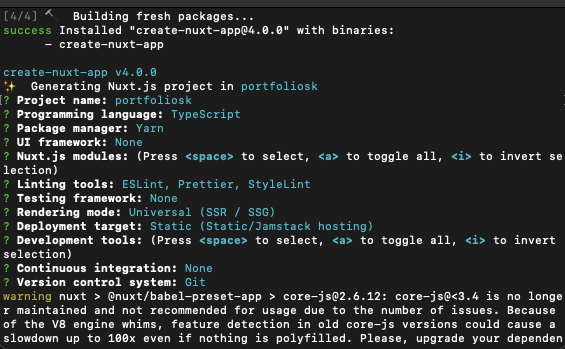
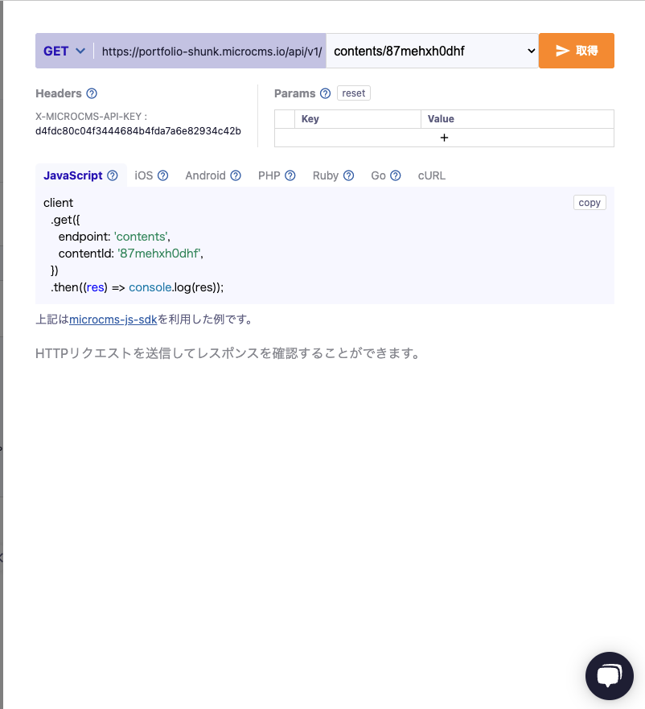

# APIを作ってみる

今回はmicroCMSというサービスを使って 
自分の成果物を返してくれるAPIを作ってみます。

## microCMSとは

日本製のヘッドレスCMSです。\
[microCMS](https://microcms.io)\
\
ヘッドレスCMSとは、一般的なCMS(Wordpressなど)から\
見た目(View)の部分の管理を取り除いたものです。\

要は、コードを書かずに\
便利な管理画面から操作するだけで\
簡単にバックエンドAPIを作成できるというサービスです。\

## 作ってみよう（以下はmicroCMSを初めて使う方の手順です）

1. microCMSのページに行きます(https://app.microcms.io/)
2. APIを作成します
   1. api名はcontents
   2. エンドポイントもcontentsと入力して「次へ」
\   
   3. リスト形式を選択して「次へ」
   4. slackにおいたファイルをインポートして「完了」
3. APIで返す情報を入力します。
   1. 右上の「＋追加」ボタン
   2. それぞれの欄を埋めて右上の「公開」ボタン
4. 以下の画像のような画面になれば成功です！

