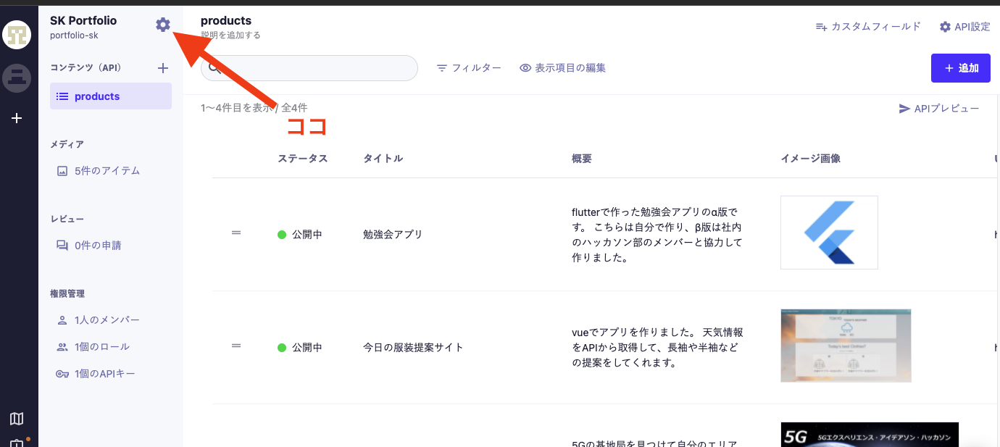
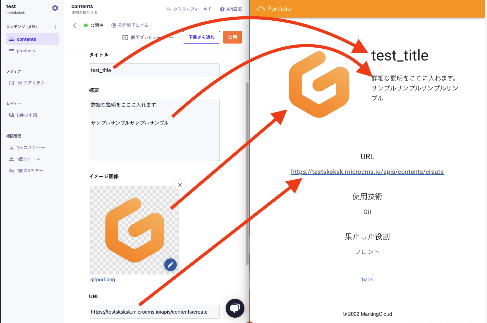

最後に、出来上がったフロントエンドのコードに\
バックエンドからデータを流し込むようにします。

# コードミッション4
## APIキーをプロジェクトに入れる
まずは作成したAPIキーを確認しにいきましょう。

1. [microCMSのページ](https://microcms.io/)に行き
2. もししていなければログインし
3. 作成したサービスを選択してください。
4. 続いて、以下の画像の矢印部分を押してください。\
   
5. サービス設定一覧の中に、APIキーがあるのでクリック
6. APIキーをコピーしてください。
7.  最後にプロジェクトのルートに.envという名前のファイルを作ってそこに以下のコードを書いてください。

```
GET_API_KEY=[あなたのAPIキー]
SERVICE_DOMAIN=[あなたのmicroCMSドメイン]
```

この[あなたのmicroCMSドメイン]という部分には\
以下の画像の部分をコピーして貼り付けてください。\


そして入力したキーを使ってmicroCMSと接続してみましょう\
/nuxt.config.jsの60行目から67行目のコメントアウトを外してください。

ここまでできればあと少しです！

## 一覧画面のデータ取得
一覧画面の製作物を自分のものに変えてみましょう。

1. /pages/index.vueの57行目から72行目までを削除してください。</br>これによりあらかじめ用意していたサンプルデータがなくなります。
2. 続いて同じファイルの60行目から69行目までのコメントアウトを解除してください。</br>これによりAPIからデータをとってくることができます。


今回の修正はサーバーの再起動を必要とします。

terminal上でcmd+c(ctrl+c)を入力して、サーバーを停止し
>yarn dev
を入力して再度サーバー立ち上げしてください

それではサイトを見てみましょう\
API作成の時にご自身で入力したデータが表示されていると思います。

## 詳細画面のデータ取得
続いて詳細画面でも同じようにAPIからデータを取得するようにしてみましょう。

1. /pages/works/_id/index.vueの44行目から52行目を削除してください。</br>これによりあらかじめ用意していたサンプルデータがなくなります。
2. 続いて同じファイルの47行まから56行目までのコメントアウトを解除してください。</br>これによりAPIからデータをとって来れるようになります。


terminal上でcmd+c(ctrl+c)を入力して、サーバーを停止し
>yarn dev
を入力して再度サーバー立ち上げしてください

それでは最後にサイトを見てみましょう

各制作物をクリックすると、作品詳細ページに遷移し\
入力したデータが表示されているはずです。

## コードの解説
/pages/works/_id/index.vueの48行目をみてください。\
ここでasyncData()というメソッドに$microcmsとparamsいう引数を渡して\
非同期にデータを取得しています。

ここで使っている$microcmsはnuxt.config.jsで定義したもの\
paramsは一覧ページからページ遷移の時に渡したidです。

50行目のendpointにはAPIの作成時に設定したendpointである"contents"とparams.idを指定し\
返ってきた値をcontentに代入しています。

そのcontentというデータを13行目や14行目などで利用して\
それぞれの製作物のデータを詳細ページに表示しています。

### もっと簡単にいうと
APIで作成したデータをJavascriptで取得して、画面に表示しています。\
イメージとしては以下の画像のような感じです。




以上で今回のハンズオンは終了です。\
JamStackでのサイト作成のイメージが湧いてもらえたら幸いです。

この後のデプロイや細かい修正は来週への宿題です。\
来週、自分流にカスタマイズしたポートフォリオを見せ合い会を行います。

楽しいと思うのでぜひ参加してみてください〜

