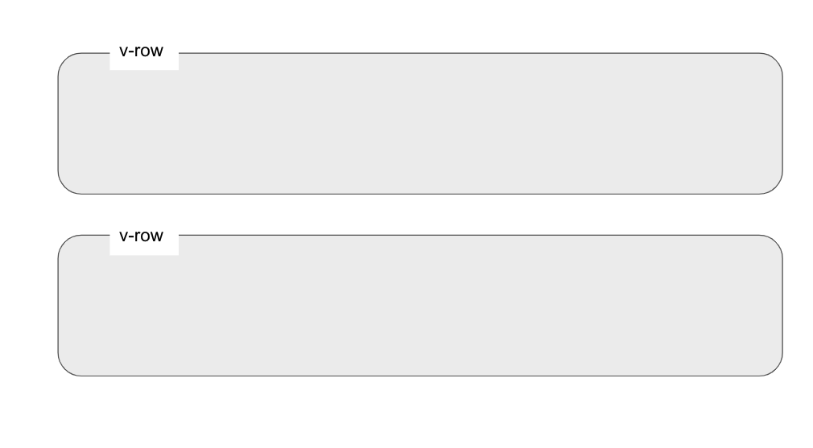
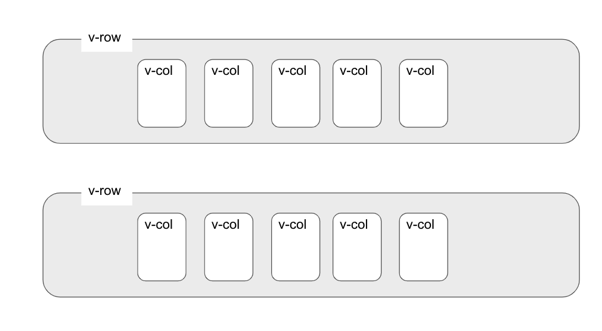

## 環境構築
gitpodで出来上がった環境を配布します。

gitpod最高！

以下をコピーして、ブラウザのurlにペーストしてください。
>gitpod.io#https://github.com/shunkat/portfolio/tree/handsOnVersion

自動でコマンドが起動し

環境を構築+ローカルサーバーの立ち上げまでやってくれます。

多少時間がかかるので少々おまちください。

### コラム
veturという拡張機能を使うとコードに色がついて見やすいです。</br>

gitpodを起動したときに</br>
自動でインストールするように設定しています。</br>
このような拡張機能のなかで今回の開発におすすめのものは以下です。\
- [Material icon thema](https://marketplace.visualstudio.com/items?itemName=PKief.material-icon-theme)
- [Auto rename tag](https://marketplace.visualstudio.com/items?itemName=formulahendry.auto-rename-tag)
- [Auto close tag](https://marketplace.visualstudio.com/items?itemName=formulahendry.auto-close-tag)
- [code runner](https://marketplace.visualstudio.com/items?itemName=formulahendry.code-runner)
- [Vue.peek](https://marketplace.visualstudio.com/items?itemName=dariofuzinato.vue-peek)

興味があれば入れてみてください。


さて起動に成功するとterminal上に</br>
>? Are you interested in participating? (Y/n) 
と表示されます。</br>

匿名化された情報をNuxtの開発体験向上のために</br>
利用させても良い場合は"Y"を入力。</br>
嫌な場合は"n"を入力してEnter</br>

以下のような画面が出れば成功です。</br>
</br>


## ソースコードを見てみる

1. 左のソースコードからpages/index.vueを見つけクリック
今回の作るサイトのトップページのソースコードがこちらです。</br>
コードをいじりながら、vue.jsやNuxt.js、Vuetifyの簡単な使い方を学びましょう。

すごく簡単に全体を説明すると\
今回のコードはフロントエンドを作成するためのもので\
トップページのコードはpages/index.vueに\
各詳細ページはpages/works/_id/index.vueに存在しています。


## Vueの便利さを知る
ソースコードの36行目を見てください。
```
<div v-for="i of 3" :key="i" class="eachProduct">
```
という記述で3回のループ処理をしており

ループ回数をiという変数に格納しています。

それを40行目や42行目で呼び出して

テキストの変更や呼び出す画像を変えるために使用しています。

このように、vueでは繰り返し処理を利用して</br>
コードの記述量を節約できます。</br>

また、v-forは後ほどAPIと連携する時に大きな力を発揮します！


### Vuetifyの超基本
2行目をみてください。

```<v-row justify="center">```

というコードがありますね。</br>
こちらのコードは、中の要素を横に配置したい時に使います。</br>
```<v-row></v-row>```
で囲まれた箇所は横の一列として表示されるということです。</br>
イメージとしては下のような感じです。


続いて7行目をみていただくと

```<v-col cols="12" align="center">```

という記述があると思います。</br>
これは逆に中の要素を縦に配置したい時に使います。</br>
この二つを合わせると以下のようなイメージです。



このように要素を配置する時はv-rowとv-colを組み合わせて</br>
好きな場所に要素を配置してください。

### コラム ワイヤーフレーム
vuetifyは公式がワイヤーフレームを提供してくれています。
ワイヤーフレームとはデザインの骨組みのことです。</br>
基本的な構成はワイヤーフレームのコードを利用してサクッと作って</br>
こだわりたいところに集中できるようにしてくれるというわけですね</br>

自分で作るときに、大きくデザインを変えたい場合</br>
ここからコードを拾えないか試してみるのがおすすめです！</br>
https://vuetifyjs.com/ja/getting-started/wireframes/


## ページ遷移してみる
コードの37行目と42行目をみてください。
```
<nuxt-link :to="`/works/`">
〜〜〜〜
</nuxt-link>
```
という記述がありますね。</br>
このnuxt-linkタグで囲った要素をクリックすると</br>

```:to=```以下に記述した箇所へ遷移します。
今回は/works/と書いているので/pages/works/index.vueに遷移します。

## 自己紹介を入力する
それでは自己紹介を自分のものに変更してみてください。


