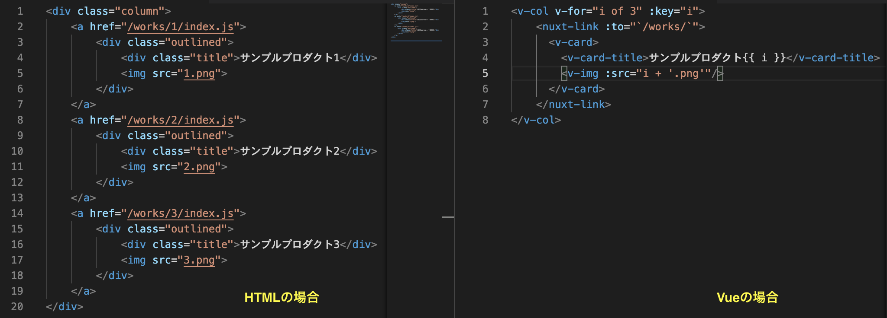

# Vue.jsの感動ポイント

左のファイル一覧からpages/index.vueを見つけクリックしてください\
今回の作るサイトのトップページのソースコードがこちらです。\

## コードミッション1
早速、ミッション1です。\
/pages/index.vueの36行目から44行目のコメントアウトを外してください。\

[サイト]('http://localhost:3000/')を見てみましょう

先ほどと違い製作物の部分にサンプルの作品が並んでいるはずです。


## 感動ポイント
/pages/index.vueの37行目に下のような記述があると思います。
```
v-for="content in contents.contents"
```
この記述によって、ループを回してコードを再利用しています\
具体的には「contents.contents」という要素が三つ入った配列を利用して\
ループを三周、回しています。

そしてそれぞれのループごとに、各要素をcontentという変数に入れて\
40行目や41行目で利用することで画像や文字を変えるのに利用しています。\

ほぼ同じ構造で、中に表示するものだけが違うものの場合\
このようにv-for文を使うとコードの記述料を節約できるのです。

もう少しわかり易いコードを用意しました。\
今回のように３つ、同じようなものを表示したい場合に\
HTMLで書くのと、Vue.jsで書く場合ではどのくらい違うのでしょうか？

\

同じものを作るのに必要なコードが半分以下に減って\
読みやすくなったのがわかりますね\


