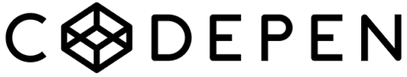

# Vuetifyの感動ポイント
Vue.jsで使えるUIフレームワークのVuetifyに感動していきましょう。

先ほど表示されるようになった詳細ページをみると\
何だか寂しいですよね。。。

このページを充実させながらVuetifyの使い方を見てみます。

## コードミッション3
pages/works/_id/index.vueを探して開いてみましょう。

開けたら7行目から16行目のコメントアウトを外してみてください。

[サイト]('http://localhost:3000/')を見てみましょう\
作品のタイトルや画像が表示されるようになっているはずです。

## 感動ポイント

### v-row
7行目と16行目をみてください。
```
<v-row>
~~~~~~~~~~~~
</v-row>
```
という記述がありますね。\
このv-rowタグで囲まれた要素は横一列に並びます。

イメージとしては下のような感じです。\
 

今回だと画像と、文字が横並びになっていますね。
### v-col
続いて12行目と15行目をみてください。
```
<v-col cols="12" align="center">
~~~~~~~~~~~~~~~~~~~~~~~~~~~~~~~~~
</v-col>
```
という記述があると思います。\
これは逆に中の要素を縦に配置したい時に使います。

今回だと作品のタイトルと詳細な説明文を縦並びにしていますね。

この二つを合わせると以下のようなイメージです。


このように要素を配置する時はv-rowとv-colを組み合わせて\
好きな場所に要素を配置してください。

### コラム「ワイヤーフレームとcodepen」

vuetifyは公式がワイヤーフレームを提供してくれています。 ワイヤーフレームとはデザインの骨組みのことです。\
基本的な構成はワイヤーフレームのコードを利用してサクッと作って\
こだわりたいところに集中できるようにしてくれるというわけですね


自分で作るときに、大きくデザインを変えたい場合\
ここからコードを拾えないか試してみるのがおすすめです！\


また細かい部品や、特徴的なデザインを取り入れたいときには\
コードペンを見に行くと良いデザインがあったりします。

コードペンはデザインを作っているコードをみることができるほか\
サイト上で細かくデザインを変えてみることができるので\
とてもおすすめです。



参考：\
[ワイヤーフレーム](https://vuetifyjs.com/ja/getting-started/wireframes/)\
[codepen](https://codepen.io/)

### 自己紹介を入力する
さて最後にハンズオンの残り時間次第ですが</br>
自己紹介部分を自分のものに変更してみてください。
