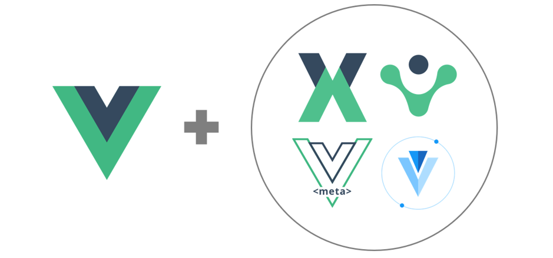
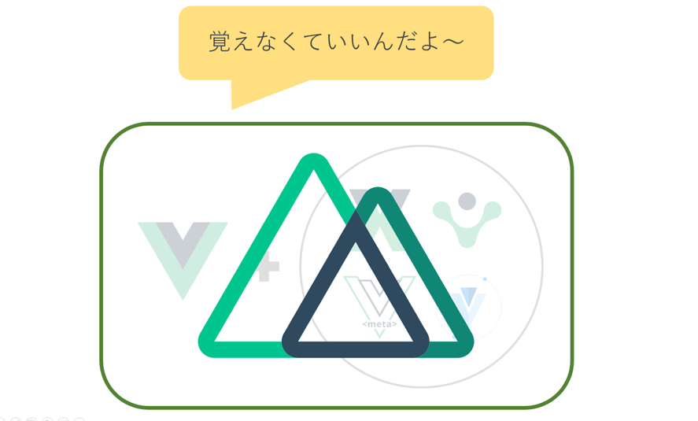

# Vue.js / Nuxt.jsとは

このページでは、今回使うJavaScript系の技術の紹介をします。

## Vue.jsとは

Vue.jsは現在人気爆発中のJavaScriptのフレームワークです。\
小さくシンプルに始めることができる、というコンセプトで開発されています。

### 特徴 1：小さくはじめてモジュールを追加して増強していく

Vue.js は簡単に導入できます。\
ただ単体ではUI を作る程度のことしかできません。\
しかし周辺モジュールが充実しており、これらを追加することで複雑な処理に対応可能です。

### 特徴　２：コンポーネント指向

コンポーネント指向 ＝ デザインパーツの組み合わせで UI を構成すること\
同じファイルに HTML, CSS, JS を書き込んでしまい、コンポーネント化して利用できます。\
つまり、ページや部品ごとに、どこにコードがあったか迷わなくて済みます。

## Nuxt.jsとは

Vueでアプリを作るために必要な周辺モジュールがまとめてあり、\
さらにいい感じに処理が自動化されたものです。\
\
周辺のモジュールを自分で整えていくのに比べると圧倒的に楽！\
かなりパワフルに自動化されてる。\
その分暗黙の了解的な記法が多く、知らないと「本当に何もわからん」となる。

個人的な感動ポイントは

1. コマンド一つでサーバーとして動くものが作成される点
2. コマンド一つでローカルサーバーを立ち上げて開発に移れる点
3. フォルダ構造がキッチリと決まっているので、どこに何があるかわかり易い点

です。

## Vuetifyとは

今回のプロダクトはvuetifyというVueのライブラリを使っています。\
\
少しだけvueとは書き方が違うのですが\
マテリアルデザインを簡単に構築できる上に、コードが非常にわかりやすいので\
今回はついでに学習してしまいましょう
